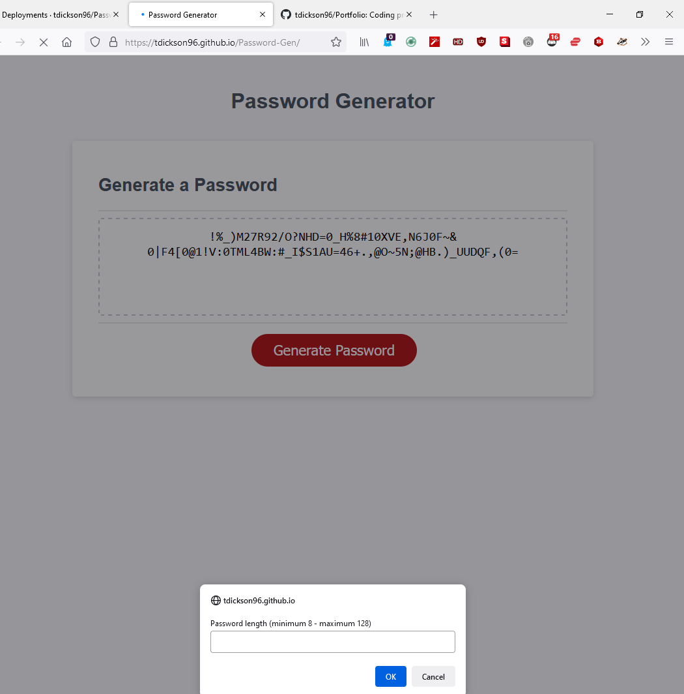
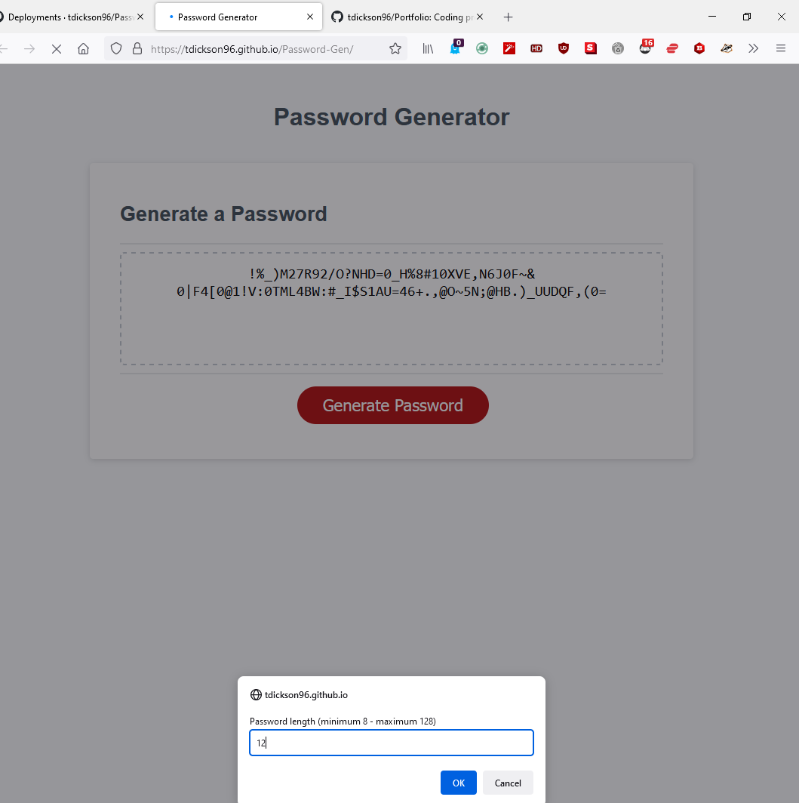
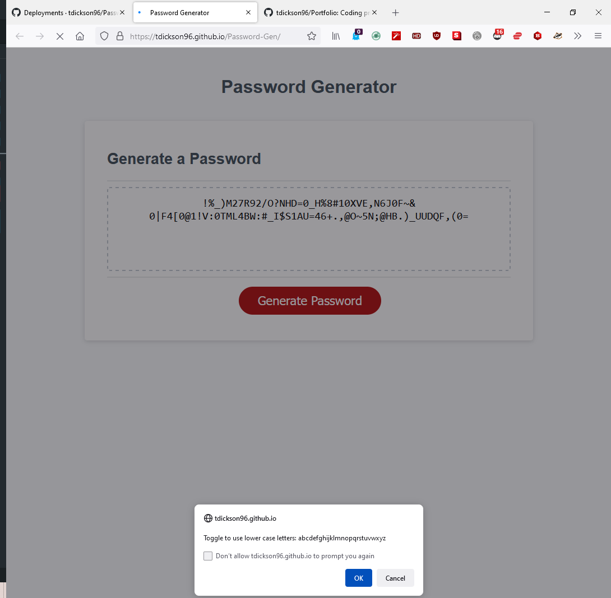
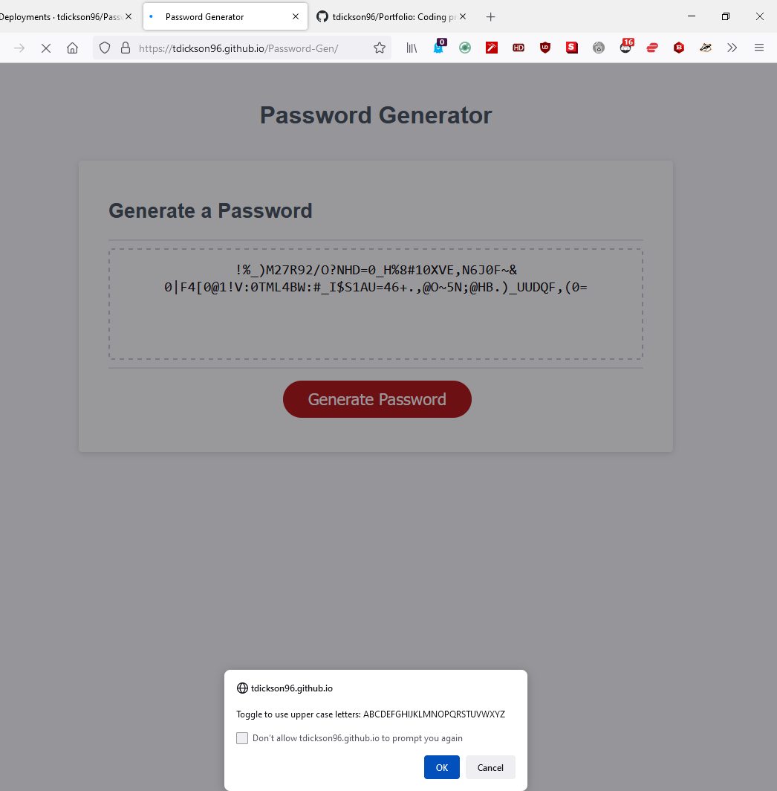
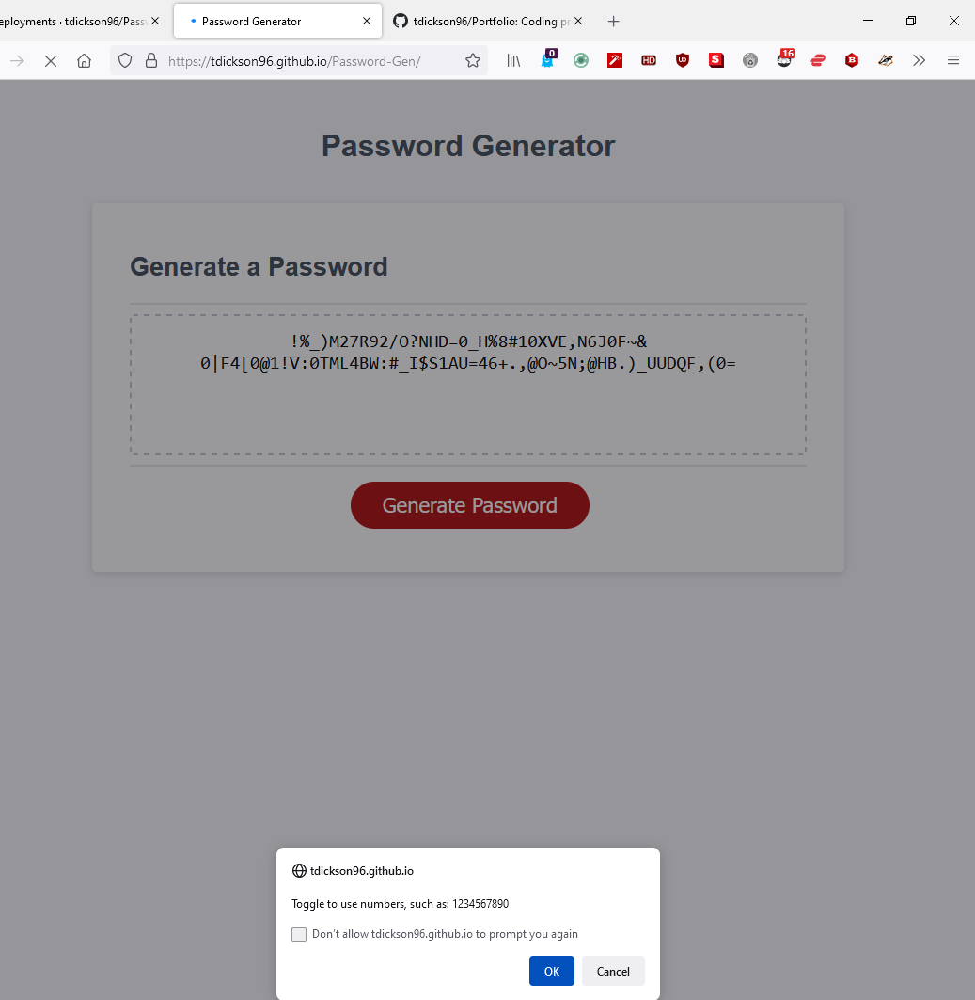
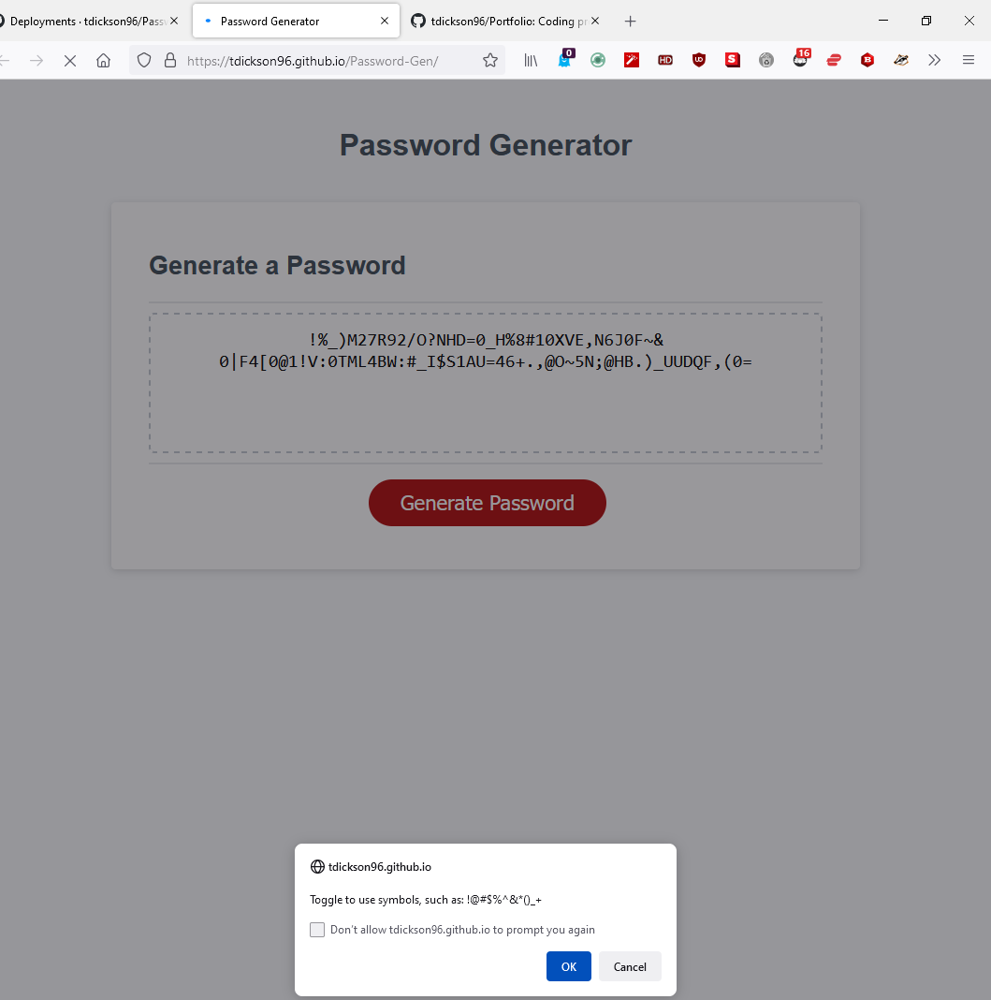
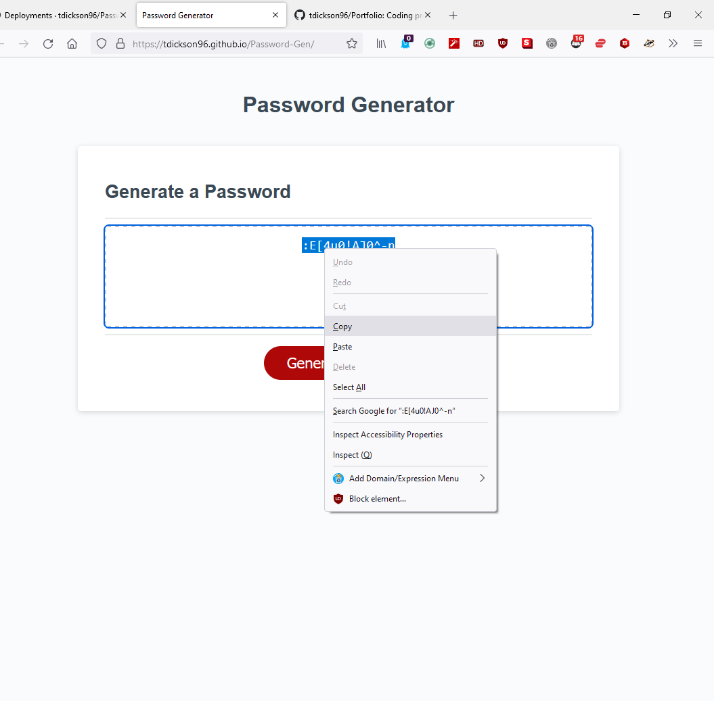

# Password Generator

## Deployment and Repository

GitHub Pages DEPLOYED: https://tdickson96.github.io/Password-Gen/ 

GitHub REPOSITORY: https://github.com/tdickson96/Password-Gen

## Description

Our client was looking for a password generator that could improve the security of her employees. We developed a webpage for the company to access that would allow employees to generate passwords with a stringency enforced by the company through the JavaScript. The generate password prompts the user with a password length

## Usage

## Credits
Trent Dickson
Godfrey Best
- - -
© 2022 Trilogy Education Services, LLC, a 2U, Inc. brand. Confidential and Proprietary. All Rights Reserved.
